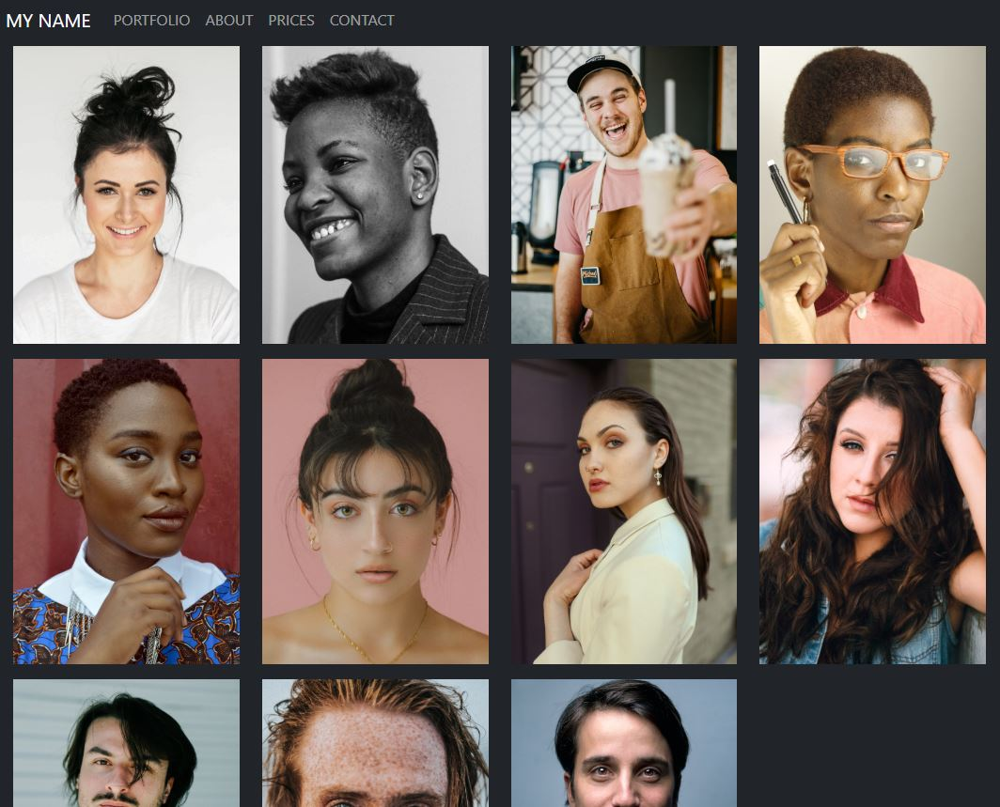

<!-- Improved compatibility of back to top link: See: https://github.com/othneildrew/Best-README-Template/pull/73 -->
<a id="readme-top"></a>
<!--
*** Thanks for checking out the Best-README-Template. If you have a suggestion
*** that would make this better, please fork the repo and create a pull request
*** or simply open an issue with the tag "enhancement".
*** Don't forget to give the project a star!
*** Thanks again! Now go create something AMAZING! :D
-->


<!-- PROJECT SHIELDS -->
<!--
*** I'm using markdown "reference style" links for readability.
*** Reference links are enclosed in brackets [ ] instead of parentheses ( ).
*** See the bottom of this document for the declaration of the reference variables
*** for contributors-url, forks-url, etc. This is an optional, concise syntax you may use.
*** https://www.markdownguide.org/basic-syntax/#reference-style-links
-->


<!-- PROJECT LOGO -->
<br />
<div align="center">
  <a href="https://github.com/vyusseem/pixel-perfect">
    
  </a>

<h3 align="center">Pixel Perfect</h3>

  <p align="center">
    Static desktop/mobile photography portfolio website made with HTML, JavaScript and Bootstrap CSS.
    <br />
    <a href="https://github.com/vyusseem/pixel-perfect"><strong>Explore the docs »</strong></a>
    <br />
    <br />
    <a href="https://github.com/vyusseem/pixel-perfect">View Demo</a>
    ·
    <a href="https://github.com/vyusseem/pixel-perfect/issues/new?labels=bug&template=bug-report---.md">Report Bug</a>
    ·
    <a href="https://github.com/vyusseem/pixel-perfect/issues/new?labels=enhancement&template=feature-request---.md">Request Feature</a>
  </p>
</div>

<!-- ABOUT THE PROJECT -->
## About The Project

This project is a web-based portfolio designed to highlight your photography. It was created using a blend of front-end technologies, including Bootstrap CSS, HTML, and JavaScript.

<!-- GETTING STARTED -->
## Getting Started
1. Clone or download the repo
   ```sh
   git clone https://github.com/vyusseem/pixel-perfect.git
   ```
3. Edit `index.html`: change to your photos, title, description, etc
4. Test locally
5. Deploy on GitHub Pages, Netlify or any HTTP server.

<!-- LICENSE -->
## License
Distributed under the MIT License. See `LICENSE.txt` for more information.

<!-- CONTACT -->
## Contact
Project Link: [https://github.com/vyusseem/pixel-perfect](https://github.com/vyusseem/pixel-perfect)

